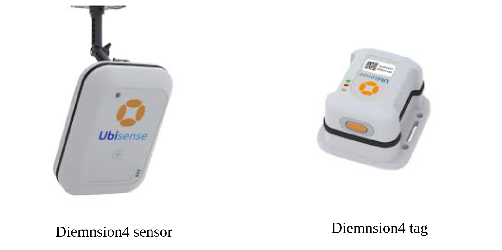
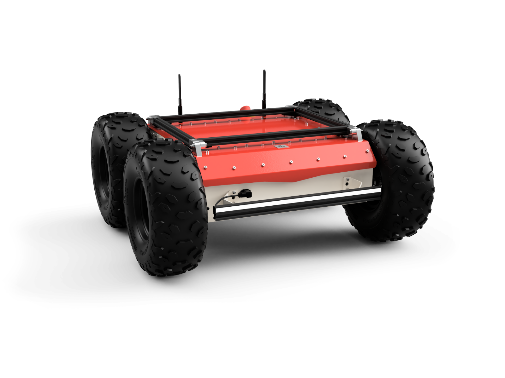
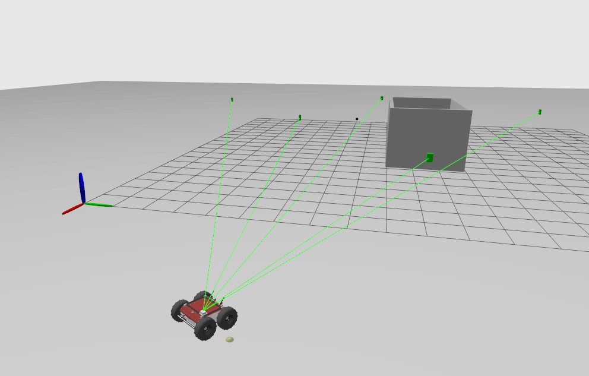

# UWB System Plugin For Igntion gazebo - ROS2

## Overview

This plugin was developed to aid in my Masters thesis project during my study at Cranfield University. The project was to integrate uwb system for mobile robot navigation insdie hangar. This plugin was designed to help with simulation before conduction actual test in the real outdoor hangar which was part of the Dartec facility at Cranfield University. Dartec Hangar is a smart hangar with a lot of sensors and cameras for monitoring the aircrafts including Ubisense UWB system.

<p align="center">
  
</p>

The UWB system was provided by Ubisense. The end goal of the developed plugin was to be able to simulate the Ubisense **Dimension 4** Sensors and Tags. 

<p align="center">
  
</p>

This project contains a system plugin for Ignition Gazebo integrated with ROS 2. The plugin simulates an Ultra-Wideband (UWB) system, providing functionality for UWB beacons and tags within the Gazebo environment.

The end goal of the research was to be able to increase the localization and the navigation capabilities of the Panther Robot in an Hangar environment which are inherently GPS denied environments.The developed plugin was used to simulate the UWB system and test the navigation algorithms before conducting the actual tests in the hangar.

<p align="center">
  
</p>


Most of the inspiration for the plugin was taken from a ROS1 UWB plugin developed by **valentinbarral**. The plugin can be found [here](https://github.com/valentinbarral/gazebosensorplugins). It was initially developed for their research work.


<hr style="border: 4px solid gray;">
<br>
<br>


## Features

- Simulates UWB beacons and tags using Ray casting in system plugin
- Publishes a Pose with covariance message for UWB Tag Based on Number of LOS beacons
- Plugin parameters can be configured in the SDF file
- VIsualization of UWB signals for both ROS and Gazebo environment
- Can set the Datum for the UWB system (Which is implemented in most of the UWB hardware systems)

<hr style="border: 4px solid gray;">
<br>
<br>


## Installation

### Prerequisites

- ROS 2 [Humble] https://docs.ros.org/en/humble/index.html
- Igntion Gazebo [Fortress LTS] https://gazebosim.org/docs/fortress/sensors 


### Building the Plugin

*If you just want to use the plugin as is, there is no need to build it. Use can use the provided `.so` plugin library in the world file.*

If you are using VS Code for development, You can use the `cmake`extension to build the plugin. The `CMakeLists.txt` file is already provided in the repository. `Cmake` extension should take care of configuring the project. Please Look out for any depdendecnies which are not available and install them maually before building.
You can have a look at the `c_cpp_properties.json` file snippet belowe to see which all igntion gaezbo librarires are required for the plugin to work.
ALso make sure before you launch Vs code, to source your Ros2 workspace. This is required for the intellisense to work properly. 

For the autocompletions to work in VS code you can use the `.vscode` folder which is provided. It has all the include directories provided for autocompletin using intelisense. Although there are some issue with the autocomplete when we use both ROS and gazebo together (I was not able to figure this out).  Bleow is a snip from the `c_cpp_properties.json` file which is provided in the `.vscode` folder. You can do this using
```bash
source /opt/ros/$ROS_DISTRO/setup.bash
```
Once source you can launch VS code using the following command.
```bash
code .
```

<hr>

```json
{
    "configurations": [
        {
            "name": "Linux",
            "includePath": [
                // "${workspaceFolder}/**",
                "/usr/include/ignition/gazebo6/**",
                "/usr/include/ignition/math6/**",
                "/usr/include/ignition/plugin1/**",
                "/usr/include/ignition/common4/**",
                "/usr/include/ignition/msgs8/**",
                "/usr/include/ignition/sdformat12/**",
                "/usr/include/ignition/transport11/**",
                "/usr/include/ignition/utils1/**",
                "/usr/include/ignition/physics5/**",
                "/usr/include/ignition/cmake2/**",
                "/usr/include/ignition/rendering6",
                "/usr/include/eigen3",

                // ros includes
                "/opt/ros/humble/include/**"
            ],
            "defines": [],
            "compilerPath": "/usr/bin/gcc",
            "cStandard": "c17",
            "cppStandard": "gnu++17",
            "intelliSenseMode": "linux-gcc-x64",
            "configurationProvider": "ms-vscode.cmake-tools"
        }
    ],
    "version": 4
}
```

when trying to include the ros rclcpp, this was not working for some reason. But when we remove the `"configurationProvider": "ms-vscode.cmake-tools"` it works. But then the intellisense for the gazebo is not working. But somehow reloading the workspace fixes the issue. I am not sure why this is happening. But this is the workaround I have found.


 You can use the following steps to build the plugin.

1. Clone the repository into your workspace:

    ```bash
    git clone

    ```

2. create a build folder in the repository and build the plugin using the following commands:

    ```bash
    mkdir build
    cd build
    cmake ..
    make
    ```

3. This should provide you with the `UWBPlugin.so` file in the build folder. You can use this file to include in the world file for the plugin to work.


OR if using VS code, you can simple press the build button for cmake extension to build the plugin.


<hr style="border: 4px solid gray;">
<br>
<br>


## Usage

### Running Ignition Gazebo with the Plugin

- To use the plugin with Ignition Gazebo, you need to include it in your world file (`.sdf` , `.world` or `urdf` file) Ideally the plugin has to be attached to the link with the Tag element in the urdf file of the robot.

```xml
<plugin name="UwbPlugin" filename="uwb_plugin.so">
  <update_rate>0.5</update_rate>
  <beacon_prefix>uwb_beacon_</beacon_prefix>
  <tag_link>tag_link_0</tag_link>
  <tag_id>0</tag_id>
  <Set_dataum>true</Set_dataum>
  <dataum_pose>10.0 10.0 0.0 0.0 0.0 1.571</dataum_pose>
  <frame_id>tag_link_0</frame_id>
</plugin>
```

The above code snippet assumes that you have a model with the name `tag_link_0` which will act as the UWB Tag. Also to be able to simulate the beacons the only requirement is that the models should have the name with the prefix `uwb_beacon_` and the plugin will automatically detect the beacons and simulate the UWB signal.

-  Make sure you have atleast one ros node initialized. As the plugin uses rclcpp to publish visualization marker data.

- In the world file you will need to include the following plugins for the uwb plugin to function properly. As it has a dependance on those plugins. You will need the following plugins in your world file.
    
    1. sensor plugin
    2. scene broadcaster plugin
    3. user command plugin

Sensor plugin  needs to be loaded for the plugin to work. This is due to the fact that to be able to do ray casting we need a scene. And a scene is only initaialised if a sensor is initiaized. So along with the sensor plugin we will also need to include a sensor. if there is no sensor required in the world just add a dummy camera sensor for the same (I belive there is a clear way to implement this, but I am not aware of it yet. So for now this is the workaround I have found.)

```xml

    <plugin
      filename="ignition-gazebo-sensors-system"
      name="gz::sim::systems::Sensors">
      <render_engine>ogre2</render_engine>
    </plugin>

    <plugin
      filename="ignition-gazebo-scene-broadcaster-system"
      name="gz::sim::systems::SceneBroadcaster">
    </plugin>

    <!-- add the user command plugin -->
    <plugin
      filename="ignition-gazebo-user-commands-system"
      name="gz::sim::systems::UserCommands">
    </plugin>
```

Below is the code for the dummy cameras ssemsor which can be added to the world file.

```xml
<model name="camera_model">
      <pose>2.5 0 1.5 0 0.0 3.14</pose>
      <link name="link">
        <pose>0.05 0.05 0.05 0 0 0</pose>
        <inertial>
          <mass>0.1</mass>
          <inertia>
            <ixx>0.000166667</ixx>
            <iyy>0.000166667</iyy>
            <izz>0.000166667</izz>
          </inertia>
        </inertial>
        <collision name="collision">
          <geometry>
            <box>
              <size>0.1 0.1 0.1</size>
            </box>
          </geometry>
        </collision>
        <visual name="visual">
          <geometry>
            <box>
              <size>0.1 0.1 0.1</size>
            </box>
          </geometry>
        </visual>
        <sensor name="camera" type="camera">
          <camera>
            <horizontal_fov>1.047</horizontal_fov>
            <image>
              <width>320</width>
              <height>240</height>
            </image>
            <clip>
              <near>0.1</near>
              <far>100</far>
            </clip>
          </camera>
        </sensor>
      </link>
      <static>true</static>
    </model>
```

- The plugin will publish the pose of the Tag based on the number of beacons in the line of sight. Directly to the ROS node on the topic `\pose`


<br>
<br>
<hr style="border: 4px solid gray;">


### Plugin Parameters

The plugin accepts the following parameters:

- `<update_rate>`: Update rate for the UWB pose publisher
- `<beacon_prefix>`: Prefix for UWB beacons.
- `<tag_link>`: Link name for the UWB tag.
- `<tag_id>`: ID for the UWB tag. (has no influence on the simulation but can be used to identify the tag if multiple tags are implemented)
- `<Set_dataum>`: Boolean to set a different origin for the UWB sensor.
- `<dataum_pose>`: Pose of the UWB datum origin relative to the Gazebo world origin (x, y, z, roll, pitch, yaw).
- `<frame_id>`: Frame ID to be used for the pose message.


<br>
<br>
<hr style="border: 4px solid gray;">


### Example

THere are 2 examples provided. one is the `test_world` file provided with this repository. In which the basic ussage of the plugin is demonstrated. You can run the world file to see the wokring of the plugin. 


<p align="center">
  
</p>


Second example demonstrates how to attach the plugin to a robot urdf file. In order to test the plugin, you can use the provided ROS2 package. Which has a test world with the becons and the tag is being attached to a panther robot. Below is the link to the repository.


-------------------------Add link-------------------------

<p align="center">
  
</p>


<hr style="border: 4px solid gray;">
<br>
<br>


## Launching The example

### Using the test world file

1. make sure you ros2 node initialized. you can use the following command to initialize the node.

```bash
source /opt/ros/$ROS_DISTRO/setup.bash
```

2. Make sure you set the path to the plugin for igntion gazebo to find the plugin. The .so plugin file is located in the build folder of the plugin. You can set the path to the plugin using the following command.

```bash
export IGN_GAZEBO_SYSTEM_PLUGIN_PATH=$IGN_GAZEBO_SYSTEM_PLUGIN_PATH:/path/to/the/build/folder/of/the/plugin
```

In case you are not going to build the plugin, instead you are going to use the plugin provided in the repository. You can set the path to the plugin using the following command.

```bash
export IGN_GAZEBO_SYSTEM_PLUGIN_PATH=$IGN_GAZEBO_SYSTEM_PLUGIN_PATH:/path/to/the/plugin
```

3. Then you can run the world file using the following command.

```bash
ign gazebo world.sdf
```
make sure you cd first to the directory where the world file is located. As internally it sets the igntion gazebo path for the models folder which is relative to the world file.


<hr style="border: 1px dotted gray;">
<br>

### Using the ROS2 package From the Repository

1. Make sure to follow to instruction on the repository to build the package. 

2. Once Build You can simply run the following command to launch the world file.

```bash
ros2 launch uwb_system_plugin test_world.launch.py
```


<br>
<br>
<hr style="border: 4px solid gray;">
<br>
<br>


## ToDo List

- [ ] Integrate UWB data with ROS 2 visualization tools
- [ ] Add support for multiple Tags
- [ ] Add support for publishing orientation data if multiple tags are used
- [ ] Add the link the ROS2 package to the repository for example in the readme file


<hr style="border: 4px solid gray;">
<br>
<br>


## Issues

Please report any issues or bugs you encounter through the [GitHub Issues](https://github.com/yourusername/uwb_system_plugin/issues) page. When reporting issues, include detailed information and steps to reproduce the problem.

<hr style="border: 4px solid gray;">
<br>
<br>


## Important Notes

- 
- 
- 

<hr style="border: 4px solid gray;">
<br>
<br>

## Contributing

Contributions are welcome! Please follow these steps to contribute:

1. Fork the repository.
2. Create a new branch (`git checkout -b feature/YourFeature`).
3. Commit your changes (`git commit -am 'Add some feature'`).
4. Push to the branch (`git push origin feature/YourFeature`).
5. Create a new Pull Request.

<hr style="border: 4px solid gray;">
<br>
<br>


## License

This project is licensed under the [Your License] License - see the [LICENSE](LICENSE) file for details.


<hr style="border: 4px solid gray;">
<br>
<br>

## Contact

For any questions or suggestions, please open an issue.